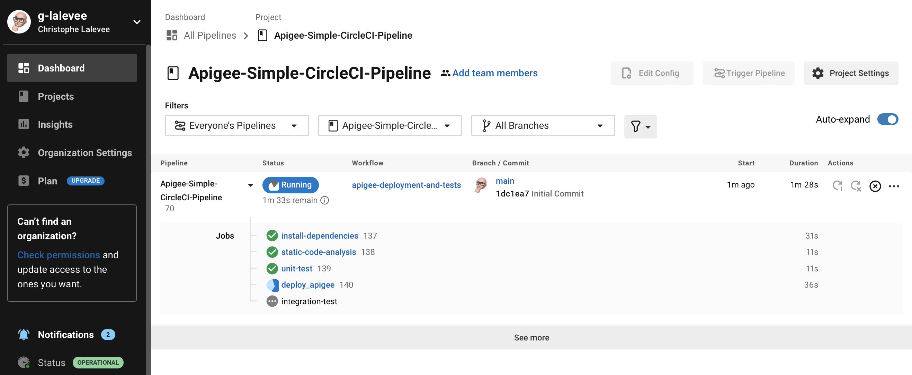

# Apigee CI/CD using GitHub, CircleCI Pipeline and Maven 

[](https://pypi.python.org/pypi/ansicolortags/) 

**This is not an official Google product.**<BR>This implementation is not an official Google product, nor is it part of an official Google product. Support is available on a best-effort basis via GitHub.

***

## Goal

Simple implementation for a CI/CD pipeline for Apigee using GitHub repository, [CircleCI](https://circleci.com/docs/2.0/pipelines/) and the [Apigee Deploy Maven Plugin](https://github.com/apigee/apigee-deploy-maven-plugin).  

The CICD pipeline includes:

- Git branch dependent Apigee environment selection and proxy naming to allow
  deployment of feature branches as separate proxies in the same environment
- Static Apigee Proxy code analysis using [apigeelint](https://github.com/apigee/apigeelint)
- Static JS code analysis using [eslint](https://eslint.org/)
- Unit JS testing using [mocha](https://mochajs.org/)
- Integration testing of the deployed proxy using [apickli](https://github.com/apickli/apickli)
- Packaging and deployment of an Apigee configuration using [Apigee Config Maven Plugin](https://github.com/apigee/apigee-config-maven-plugin)
- Packaging and deployment of the API proxy bundle using [Apigee Deploy Maven Plugin](https://github.com/apigee/apigee-deploy-maven-plugin)

**This CICD pipeline allows deployment to both Apigee Edge and Apigee X/hybrid. <BR>A variable (API_VERSION) in .circleci/config.yml file defines the deployment target.**


### API Proxy and Apigee configuration

The folder [./apiproxy](./apiproxy) includes a simple API proxy bundle, a simple Apigee configuration file [./EdgeConfig/edge.json](./EdgeConfig/edge.json). The root folder contains as well the following resources:

- [.circleci/config.yml File](./.circleci/config.yml) to define a CircleCI multi-branch pipeline.
- [test Folder](./test) to hold the unit and integration tests.


## Target Audience

- Operations
- API Engineers
- Security

## Limitations & Requirements

- The authentication to the Apigee Edge management API is done using OAuth2. If you require MFA, please see the [documentation](https://github.com/apigee/apigee-deploy-maven-plugin#oauth-and-two-factor-authentication) for the Maven deploy plugin for how to configure MFA.
- The authentication to the Apigee X / Apigee hybrid management API is done using a GCP Service Account. See [CI/CD Configuration Instructions](#CI/CD-Configuration-Instructions).

## Prerequisites

### CircleCI

The setup described in this reference implementation is based on [CircleCI](https://circleci.com).<BR> 
From your CircleCI account, create a new project linked to your GitHub repository: cf [CircleCI Projects and Pipelines](https://circleci.com/docs/2.0/project-build/#adding-projects).


## CI/CD Configuration Instructions

### Apigee hybrid / Apigee X only

Apigee hybrid / Apigee X deployement requires a GCP Service Account with the following roles (or a custom role with all required permissions):

- Apigee API Admin
- Apigee Environment Admin

To create it in your Apigee organization's GCP project, use following gcloud commands (or GCP Web UI):

```sh
SA_NAME=<your-new-service-account-name>

gcloud iam service-accounts create $SA_NAME --display-name="CircleCI-ci Service Account"

PROJECT_ID=$(gcloud config get-value project)
CircleCI_SA=$SA_NAME@$PROJECT_ID.iam.gserviceaccount.com

gcloud projects add-iam-policy-binding "$PROJECT_ID" \
  --member="serviceAccount:$CircleCI_SA" \
  --role="roles/apigee.environmentAdmin"

gcloud projects add-iam-policy-binding "$PROJECT_ID" \
  --member="serviceAccount:$CircleCI_SA" \
  --role="roles/apigee.apiAdmin"

gcloud iam service-accounts keys create $SA_NAME-key.json --iam-account=$CircleCI_SA --key-file-type=json 

```

Copy `<your-new-service-account-name>-key.json` file content to clipboard. 

### Initialize a GitHub Repository

1.  **Create a GitHub repository to hold your API Proxy** <BR>

To use the `Apigee-Simple-CircleCI_CI-Pipeline`
in a **GitHub** repository `github.com/my-user/my-api-proxy-repo` follow these
steps:

```bash
git clone git@github.com:g-lalevee/Apigee-Simple-CircleCI_CI-Pipeline.git
cd Apigee-Simple-CircleCI_CI-Pipeline
git init
git remote add origin git@github.com:my-user/my-api-proxy.git
git checkout -b feature/cicd-pipeline
git add .
git commit -m "initial commit"
git push -u origin feature/cicd-pipeline
```


### CircleCI Project Configuration 

> If the target is Apigee Edge...

1.  Add custom environment variables `APIGEE_CREDS_USR` and `APIGEE_CREDS_PSW`, to store your Apigee User ID and password:
- Go to your CircleCI project’s Settings > Environment Variables menu.
- Click the **Add Environment Variable** button.<BR>In the Add Environment Variable modal, fill in the details:
  - Name: APIGEE_CREDS_USR
  - Value: your Apigee user ID 
  - Click the **Add Environment Variable** button
- Click again the **Add Environment Variable** button.<BR>In the Add Environment Variable modal, fill in the details:
  - Name: APIGEE_CREDS_PSW
  - Value: your Apigee user ID password
  - Click the **Add Environment Variable** button

> If the target is Apigee X / Apigee hybrid

2.  Add custom environment variable `GCP_SERVICE_ACCCOUNT`, to store your GCP Service Account json key:
- Go to your CircleCI project’s Settings > Environment Variables menu.
- Click the **Add Environment Variable** button.<BR>In the Add Environment Variable modal, fill in the details:
  - Name: GCP_SERVICE_ACCCOUNT
  - Value: paste clipboard
  - Click the **Add Environment Variable** button

## Run the pipeline

Using your favorite IDE...
1.  Update the CircleCI **./.circleci/config.yml** file.<BR>
In global **parameters** section, change **DEFAULT_APIGEE_ORG**, **DEFAULT_APIGEE_ENV**, **TEST_HOST** values by your target Apigee organization and environment, and the FQDN of the (future) deployed API (used for integration testing).<BR>
Update **API_VERSION** variable to define the Apigee target version: `googleapi` = Apigee X / Apigee hybrid, `apigeeapi` = Apigee Edge
2.  Read carefully the **setup-environment** step in **deploy_apigee** job to check if the multibranch rules match your Git and Apigee environment naming and configuration.
3. Save
4. Commit, Push.. et voila!


Use the CircleCI UI to monitor your pipeline execution:

- Go to your **Projects** menu, click on your project name to see the workflow and jobs running.



- Click on the workflow name to see jobs orchestration.
<BR>Click on a job name to see steps logs.
<BR>At the end of a testing job (or step), click on **Artifact** menu to see generated artifact.
<BR>For example, the results of integration tests with Apickli.


